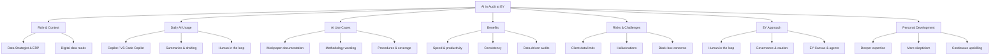

```mermaid
flowchart TD
  A[AI in Audit at EY]
  A --> B[Role & Context]
  B --> B1[Data Strategist & ERP]
  B --> B2[Digital data roads]
  A --> C[Daily AI Usage]
  C --> C1[Copilot / VS Code Copilot]
  C --> C2[Summaries & drafting]
  C --> C3[Human in the loop]
  A --> D[AI Use Cases]
  D --> D1[Workpaper documentation]
  D --> D2[Methodology wording]
  D --> D3[Procedures & coverage]
  A --> E[Benefits]
  E --> E1[Speed & productivity]
  E --> E2[Consistency]
  E --> E3[Data-driven audits]
  A --> F[Risks & Challenges]
  F --> F1[Client-data limits]
  F --> F2[Hallucinations]
  F --> F3[Black-box concerns]
  A --> G[EY Approach]
  G --> G1[Human in the loop]
  G --> G2[Governance & caution]
  G --> G3[EY Canvas & agents]
  A --> H[Personal Development]
  H --> H1[Deeper expertise]
  H --> H2[More skepticism]
  H --> H3[Continuous upskilling]
```
